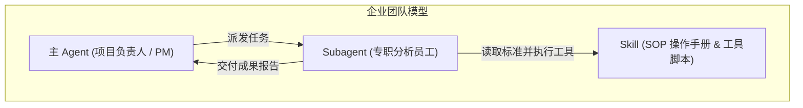
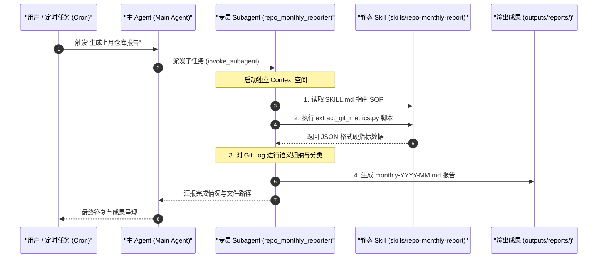

Title: Skill、Subagent 与 Agent 究竟是什么？从一个月度总结实战谈 AI 原生架构
Date: 2026-07-22 11:45:00
Tags: ai, agent, subagent, skill, architecture
Slug: demystifying-skill-subagent-and-agent
Author: 老树
Summary: 本文通过一个真实的“仓库月度自动统计与总结报告”落地需求，深入剖析 Skill、Subagent 和 Agent 三者的本质区别、协作模式与持久化原理，帮助读者建立对 AI 原生架构最直观透彻的认识。
Mermaid: true


在大模型（LLM）和 AI 智能体（Agent）快速演进的今天，我们在使用类似 Claude Code、Google Antigravity、AutoGPT 等 AI 编程助手或 Agent 框架时，经常会听到几个核心词汇：**Agent**、**Subagent** 和 **Skill**。

很多开发者往往会感到困惑：
- *“Skill 和 Agent 到底有什么区别？不都是给 AI 用的工具吗？”*
- *“既然主 Agent 已经能干活了，为什么还需要 Subagent？”*
- *“Subagent 到底是保存在内存里的一个虚无概念，还是一个真正的代码实体？”*

为了彻底说清楚这三者的概念与工程落地，本文将结合一个真实的实战需求——**“每月自动统计代码仓库变化并生成结构化月报”**，手把手拆解这套 AI 原生架构。

---

## 一、 形象比喻：企业团队的运作模型

要搞懂这三者的关系，最直观的方式就是对比一个**现代企业项目团队**的日常分工：



| 维度 | Agent (主智能体) | Subagent (子智能体) | Skill (技能/工具包) |
| :--- | :--- | :--- | :--- |
| **现实比喻** | **项目负责人 / PM** | **专职员工 / 专项专员** | **SOP 操作手册 / 员工指南 / 工具箱** |
| **本质属性** | 全局控制中枢，负责响应用户输入与任务调度。 | 动态派生的独立 LLM 线程/会话，专注解决单一复杂子任务。 | 静态的指令集、规范文件（如 Markdown SOP）及可执行脚本。 |
| **上下文 (Context)** | 包含与用户对话的全部主历史。 | **完全隔离**的独立上下文空间，不受主对话噪音干扰。 | 没有上下文，它是被读取的文件与调用的工具。 |
| **生命周期** | 贯穿整个 Chat Session 过程。 | 被唤醒时启动，完成特定任务后提交结果并结束。 | 长期静态保存在项目 Git 仓库中。 |

> 💡 **核心一句话：**
> **Skill 告诉 Agent“标准和工具是什么”；Subagent 是真正“带上工具、在独立房间里闭门干活的员工”。**

---

## 二、 真实需求场景：每月仓库变化统计与月报生成

假设我们在一个项目中需要增加一个自动化能力：**每月自动统计本仓库的代码提交、文档新增、模块变动，并形成一份有深度、有分类总结的月度 Markdown 报告**。

### 为什么单纯靠“主 Agent + 提示词”很笨重？

如果直接让主 Agent 在当前对话窗口里去干这件事情：
1. **上下文严重污染**：主 Agent 需要读取近 30 天几十上百条提交记录和几百个文件的变更 diff。这些巨量日志会瞬间塞满主对话窗口的 Context Window。
2. **效率与成本低下**：海量的中间数据会使后续每句聊天的 Token 消耗急剧增加，甚至导致主 Agent “头晕遗忘”之前的上下文。

因此，完美的解法就是：**Skill + Subagent 协同架构**。

---

## 三、 架构设计与落地实现

整个系统的运作流程如下图所示：



### 1. 第一步：打造 Skill（静态 SOP 与工具箱）

在仓库中建立 `skills/repo-monthly-report/` 目录：

1. **`SKILL.md` (标准操作流程指南)**：
   定义了报告的四大归纳维度（如 AI 技能库、投资模型、学术论文、项目清理）、报告保存路径规范（`outputs/reports/monthly-YYYY-MM.md`）以及标准的 Markdown 结构模板。
2. **`scripts/extract_git_metrics.py` (数据提取脚本)**：
   用 Python 自动化提取过去指定天数的提交总数、贡献者、增删代码行数及按业务模块分类的文件列表。

```python
# extract_git_metrics.py 核心片段
def categorize_file(filepath):
    """根据文件路径进行业务模块分类"""
    if filepath.startswith("articles/"):
        return "学术论文/文章 (articles/)"
    elif filepath.startswith("invest/"):
        return "投资/金融模型 (invest/)"
    elif filepath.startswith("skills/"):
        return "AI Agent Skills (skills/)"
    # ...其他分类逻辑
```

### 2. 第二步：定义并派生 Subagent（动态分析员工）

主 Agent 通过声明并派生一个名为 `repo_monthly_reporter` 的子智能体：

```json
{
  "name": "repo_monthly_reporter",
  "role": "Repo Monthly Reporting Specialist",
  "system_prompt": "你是一个专业的仓库月报生成子智能体。严格遵守 skills/repo-monthly-report/SKILL.md 规范，运行 Python 统计脚本，对业务模块进行深度语义归纳，生成月报保存至 outputs/reports/。"
}
```

随后主 Agent 执行 `invoke_subagent` 派发任务：
**Subagent 启动后，在自己独立的 Context 空间内加载 Skill，运行 Python 脚本提取了 18 个变更文件与 -45,831 行数据，并完成了深度语义总结。**

### 3. 第三步：生成结构化月度报告

最终生成的月报 `outputs/reports/monthly-2026-07.md` 包含了极其清晰的业务图景：

- **总体概览**：代码新增 +621 行，清理 -45,831 行大文本与废弃文件。
- **三大核心亮点**：
  1. 上线 `pdf-watermark` 水印 Agent 技能包；
  2. 新增《价值平均定投法》金融知识文档与配套 Excel 工具；
  3. 彻底清理老旧爬虫数据集与临时产物。

---

## 四、 核心追问：Subagent 究竟保存在哪里？

在实际工程中，很多人会好奇：**Subagent 到底是一个保存在硬盘上的实体，还是仅仅一串临时提示词？**

答案是：**它既有运行态的实体，也有静态配置的储存**。

### 1. 运行态实体 (Runtime Entity)
当 Subagent 被派生时，系统真正为其建立了独立的进程与存储路径。
例如本次运行中，Subagent 的完整推理过程、思维链以及中间工具调用历史，真实地保存在本地磁盘上：
`~/.gemini/antigravity/brain/<subagent-conversation-id>/.system_generated/logs/transcript.jsonl`

这也正是为什么它的运行不会占用或污染主 Agent 的 Context 窗口。

### 2. 配置与定义持久化 (Persistence)
- **动态注册（会话级 Session Scope）**：通过 `define_subagent` 工具在运行内存中注册，仅对当前 Chat Session 有效，重启后注册表中不保留。
- **静态配置文件（项目级 Project Scope）**：将 Subagent 的 Prompt 和角色写入项目的配置文件（如 `AGENTS.md` 或 `.claude/agents/`），这样每次打开客户端或任何人拉取仓库代码，系统均会自动识别并加载该 Subagent。

```
[仓库根目录]
├── skills/                      <-- 静态 Skill 目录 (跟随 Git 永久持久化)
│   └── repo-monthly-report/
│       ├── SKILL.md
│       └── scripts/extract_git_metrics.py
├── AGENTS.md                    <-- 静态 Subagent 配置文件 (项目级持久化)
└── outputs/reports/             <-- 成果输出路径
```

---

## 五、 工程总结：何时用 Skill？何时用 Subagent？

在设计 AI 原生系统或进行 Agentic Workflow 开发时，可以遵循以下**三分法原则**：

1. **写成 Skill**：
   - 凡是**静态的操作流程 (SOP)**、代码规范、文档模板、纯 Python/Shell 工具脚本，通通写成 Skill 放在 `skills/` 目录下。它是纯粹的知识与工具沉淀。
2. **定义 Subagent**：
   - 凡是需要**大量上下文消耗**（如读大量日志、审阅成百上千行代码）、**并发处理**、或**特定专业角色设定**（如专业 Code Review 员、安全审计员、月报撰写专员）的任务，定义为 Subagent。
3. **主 Agent 负责调度**：
   - 主 Agent 保持轻量，专注于倾听用户的复杂指令，做顶层任务拆解，并发派给对应的 Subagent 去完成。

通过这套架构，我们不仅实现了一个自动化的仓库月报工具，更彻底搞懂了 AI 原生开发中最核心的三大基石理念。
