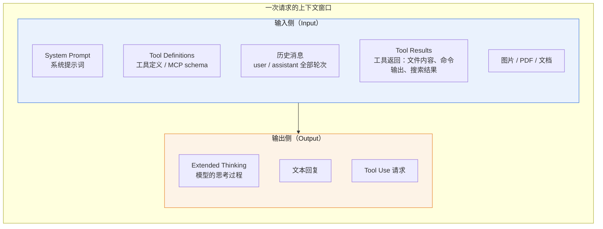
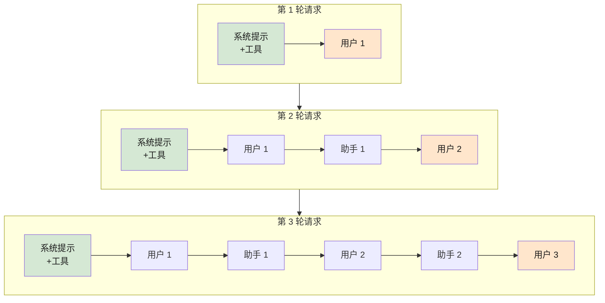
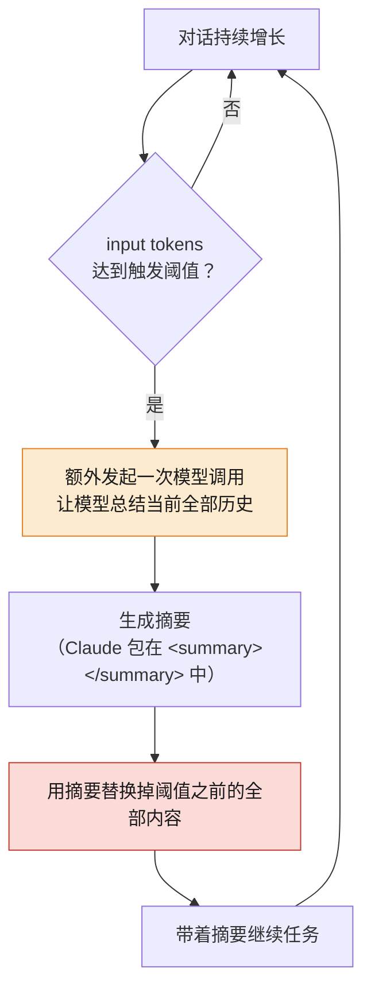
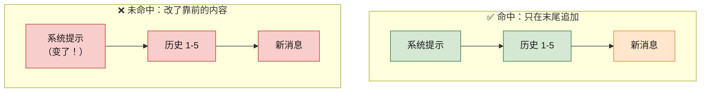
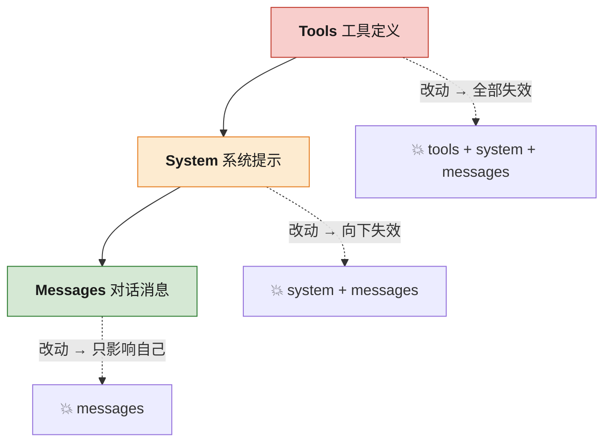
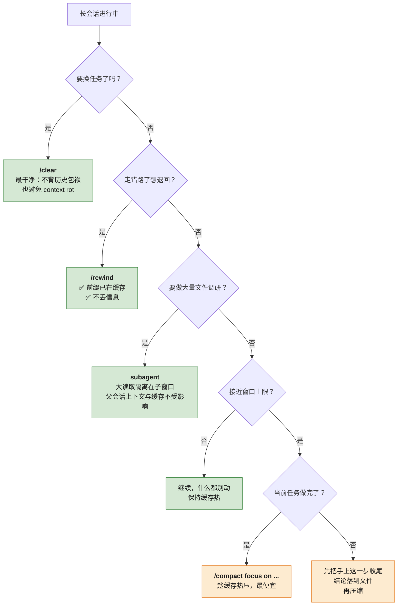

Title: 上下文、压缩与缓存：大模型使用者必须搞懂的三个概念
Date: 2026-08-02 22:50:00
Tags: ai, llm, claude, codex, context, cache, agent
Slug: llm-context-compaction-caching
Author: 小生说大声讲
Summary: 100 万上下文到底指什么？什么时候该压缩、Claude Code 与 Codex 各自何时自动触发？缓存为什么会失效、失效了到底损失什么？本文以 Anthropic 与 OpenAI 官方文档为准，用 7 张图把这三个概念串成一条因果链，并给出可直接照做的日常实践。
Mermaid: true

> 面向日常重度使用 Claude Code / Codex 等 AI 编程工具的工程师。所有涉及 Claude 与 Codex 的技术细节均以官方文档为准，文末附完整出处。

## 0. 先给一个心智模型

这三个概念不是并列关系，而是一条因果链：


一句话概括三者的取舍差异，这是全文最重要的一句：

| | 触发时发生什么 | 代价 | 会不会丢信息 |
|---|---|---|---|
| **缓存失效** | 重新计算整个前缀 | **变贵 + 变慢** | **不会**，模型看到的内容完全一致 |
| **上下文压缩** | 历史被摘要替换 | 一次额外的模型调用 | **会**，细节永久丢失 |

很多人把两者混为一谈。**缓存失效只是钱和延迟的问题，压缩才是真正会伤害任务质量的操作。** 后面所有的实践建议都从这条区别推导而来。

---

## 1. 上下文（Context Window）

### 1.1 官方定义

Anthropic 官方文档的定义是：

> "The 'context window' refers to all the text a language model can reference when generating a response, including the response itself."
>
> —— 上下文窗口指的是模型生成回复时能够引用的全部文本，**包括回复本身**。

有两个要点常被误解：

**第一，它不是模型的知识，是模型的"工作记忆"。** 官方特别强调它 "is different from the large corpus of data the language model was trained on"（区别于训练语料）。训练知识是模型权重里固化的东西；上下文窗口是这一次请求临时塞进去的东西。

**第二，输出也占窗口。** "100 万上下文"不是"你可以输入 100 万 token，模型再额外输出"，而是**输入 + 输出总共不超过 100 万**。

### 1.2 所以"100 万上下文"到底指什么

指的是**单次 API 请求中，输入与输出 token 数之和的上限是 1,000,000**。

具体到什么东西会占用它，官方列举得非常清楚：



原文表述：

> "Everything in the request counts toward the context window: the system prompt, every message in `messages` (including tool results, images, and documents), and your tool definitions. The output Claude generates for the turn, including its extended thinking, counts too."

一个反直觉但很重要的补充：**缓存过的内容照样占窗口**。

> "Cached prompt prefixes still occupy the context window: prompt caching changes what you pay for those tokens, not whether they count."

缓存省的是钱和时间，不是空间。

### 1.3 关键推论：模型是无状态的，每轮都在重发全部历史

这是理解后面一切的基础。Claude Code 官方文档说得最直白：

> "The model doesn't remember anything between requests, so Claude Code re-sends the full context: the system prompt, your project context, every prior message and tool result, and your new message."

也就是说，你在终端里看到的"连续对话"是个幻觉。实际发生的是：



绿色部分每轮完全相同，橙色是每轮新增的部分。**正因为绝大部分内容重复，缓存才有意义；也正因为历史只增不减，窗口才会满，才需要压缩。**

### 1.4 Context Rot：为什么"塞满"是个坏主意

官方明确警告：更大的窗口不等于更好的效果。

> "more context isn't automatically better. As token count grows, accuracy and recall degrade, a phenomenon known as *context rot*. This makes curating what's in context just as important as how much space is available."

**上下文腐烂（context rot）**：随着 token 数增长，模型的准确率和召回率会下降。所以"精心筛选放什么进去"和"有多大空间"同等重要。

这直接影响你该怎么用工具：一个跑了 3 小时、塞满了 50 个文件内容的 session，即使还没到窗口上限，效果也已经在衰减了。主动 `/clear` 往往比死撑到自动压缩更好。

### 1.5 当前主流模型的窗口大小

**Claude 系列**（官方文档）：

| 模型 | 上下文窗口 | 单次最大输出 |
|---|---|---|
| Claude Fable 5 / Mythos 5 | 1M | 128K |
| Claude Opus 5 / 4.8 / 4.7 / 4.6 | 1M | 128K |
| Claude Sonnet 5 / Sonnet 4.6 | 1M | 128K |
| Claude Sonnet 4.5 及其他更早模型 | 200K | — |

要点：

- 1M 是**默认值**，不需要 beta header：*"For every model with a 1M-token context window, 1M is the default: you don't need a beta header."*
- 1M 按**标准价格**计费，超过 200K 没有溢价：*"A 900k-token request is billed at the same per-token rate as a 9k-token request."*
- 单次请求最多 600 张图片或 PDF 页（200K 窗口的模型是 100 张）。
- ⚠️ **Claude 4.7 及之后的模型换了新分词器，同样的文本会多出约 30% 的 token**（*"This tokenizer produces approximately 30% more tokens for the same text"*）。所以拿 4.6 的 token 数经验去估 4.7+ 会偏低。

**OpenAI GPT-5.6 Sol**（官方模型页）：

| 项目 | 数值 |
|---|---|
| 上下文窗口 | 1,050,000 |
| 单次最大输出 | 128,000 |
| 长上下文计费门槛 | **超过 272K 输入 token 的请求，整个请求按 2× 输入价、1.5× 输出价计费** |

原文：*"Prompts with >272K input tokens are priced at 2x input and 1.5x output for the full request."*

这个 272K 门槛非常关键，也是 Codex 社区里各种"为什么是 272K"讨论的根源——**它是一条计费红线，不是能力上限**。特别注意措辞是 "for the full request"：一旦越线，**整个请求**都按 2 倍输入价计费，而不只是超出的那部分 token。所以在接近 272K 时主动压缩，省下的不是一点边际成本，而是整轮请求的一半。

### 1.6 窗口满了会发生什么（API 层面）

- **输入本身就超了**：所有模型都返回 400 `invalid_request_error`（"prompt is too long"）。
- **输入 + `max_tokens` 超了**：Claude 4.5 及更新的模型会接受请求，生成到上限时以 `stop_reason: "model_context_window_exceeded"` 停止；更早的模型直接报校验错误。

### 1.7 一个容易被忽略的机制：Context Awareness

Claude Sonnet 5 / Sonnet 4.6 / Sonnet 4.5 / Haiku 4.5 具备**上下文感知**能力——API 会自动往系统提示里注入模型的 token 预算：

```xml
<budget:token_budget>200000</budget:token_budget>
```

每次工具调用后还会追加剩余量提示：

```xml
<system_warning>Token usage: 35000/200000; 165000 remaining</system_warning>
```

这让模型能"知道自己还剩多少余量"，从而主动规划长任务节奏，而不是盲目往下做。这些标签是 API 自动注入的，你不需要也不应该自己发送。

Opus 4.7 及之后的 Opus、Fable 5、Mythos 5 **不接收**这些注入标签，改用 beta 的 task budgets 机制。

### 1.8 Extended Thinking 与窗口的关系

思考（thinking）token 的计费与占用规则值得单独说明：

- thinking token 属于 `max_tokens` 的一部分，**按输出 token 计费**，计入速率限制。
- **历史思考块是否保留，取决于模型**：
  - Opus 4.5+、Sonnet 4.6+、Fable 5、Mythos 5：**默认保留**，作为后续请求的输入 token 计费。
  - 更早的 Opus/Sonnet 与所有 Haiku：API 自动剥离历史思考块（你传回去它也会自动删），为对话内容腾出空间。
- **唯一必须回传 thinking 块的场景**：工具调用循环中，提交 `tool_result` 时必须原样带上对应的完整 thinking 块（含签名）。API 用密码学签名校验，改动就会报错。

---

## 2. 压缩（Compaction）

### 2.1 什么情况下应该压缩

先区分三种"腾空间"的手段，它们代价完全不同：

| 手段 | 做了什么 | 信息损失 | 缓存影响 |
|---|---|---|---|
| **压缩（Compaction）** | 历史 → 一段摘要 | 大，细节永久丢失 | 打断（对话层前缀完全变了） |
| **上下文编辑（Context Editing）** | 只清除旧的工具结果 / 思考块 | 中，仅丢工具输出 | 打断（清除位置之后失效） |
| **清空（/clear、开新 session）** | 全部丢弃 | 全部（但你是主动的） | 重建，但系统提示层可能仍命中 |

**该压缩的时机（按优先级）：**

1. ✅ **任务与任务之间的自然断点** —— 最佳时机。你已经不需要上一个任务的细节了，压缩几乎零损失。
2. ✅ **快到窗口上限，但当前任务还没做完** —— 不得不压，让它压。
3. ❌ **任务做到一半、正在调试细节时** —— 最糟。摘要会丢掉你刚建立起来的关键上下文。
4. ❌ **换新任务时** —— 这时应该 `/clear` 而不是 `/compact`。压缩会把无关的旧任务摘要一直背在身上，既占 token 又干扰模型。

Claude Code 官方给的建议正是这一条：

> "run `/compact` at a natural break in your work, such as between tasks, instead of waiting for auto-compaction to trigger mid-task."

### 2.2 压缩的通用流程



注意 **C 这一步是一次真实的、额外的模型调用**——它要消耗 token、计费、占用速率限制。这是压缩的隐性成本。

### 2.3 Claude：官方 API 的服务端压缩

Anthropic 提供了**服务端压缩**（beta），是官方推荐的长会话上下文管理方案：

> "Server-side compaction is the recommended strategy for managing context in long-running conversations and agentic workflows."

**配置方式：**

```json
{
  "context_management": {
    "edits": [{
      "type": "compact_20260112",
      "trigger": { "type": "input_tokens", "value": 150000 }
    }]
  }
}
```

需要 beta header：`anthropic-beta: compact-2026-01-12`

**关键参数与规则：**

| 项目 | 说明 |
|---|---|
| 默认触发阈值 | `input_tokens = 150,000` |
| 阈值下限 | **必须 ≥ 50,000** |
| 触发类型 | 目前仅支持 `input_tokens` |
| `pause_after_compaction` | 为 `true` 时压缩后返回 `stop_reason: "compaction"`，让你有机会插入内容 |
| `instructions` | 自定义摘要提示词，**完全替换**默认提示词（不是追加） |
| 支持模型 | Fable 5、Mythos 5、Mythos Preview、Opus 5、Opus 4.8–4.6、Sonnet 5、Sonnet 4.6 |

**执行后发生什么：** 响应里会出现一个 `compaction` 块。后续请求中，*"the API automatically drops all content blocks prior to the `compaction` block and continues from the summary."*——API 自动丢弃压缩块之前的所有内容。你必须把这个 compaction 块原样传回去。

**计费方式（重要）：** 压缩会多出一次采样迭代，`usage` 里用 `iterations` 数组分开记账：

```json
{
  "usage": {
    "input_tokens": 23000,
    "output_tokens": 1000,
    "iterations": [
      { "type": "compaction", "input_tokens": 180000, "output_tokens": 3500 },
      { "type": "message",    "input_tokens": 23000,  "output_tokens": 1000 }
    ]
  }
}
```

⚠️ **顶层的 `input_tokens` / `output_tokens` 只反映非压缩迭代**。要算真实总消耗，必须把 `iterations` 全部加起来。只看顶层字段会严重低估账单。

### 2.4 Claude：更精细的替代方案——Context Editing

如果压缩太"重"（一次性丢掉所有细节），可以用 **context editing**（beta header：`context-management-2025-06-27`）：

**工具结果清除** `clear_tool_uses_20250919`：

| 参数 | 默认值 | 说明 |
|---|---|---|
| `trigger` | 100,000 input tokens | 何时开始清除 |
| `keep` | 3 tool uses | 保留最近几组工具调用/结果 |
| `clear_at_least` | 无 | 至少清除多少 token，否则不动手 |
| `exclude_tools` | 无 | 永不清除哪些工具的结果 |
| `clear_tool_inputs` | `false` | 是否连工具入参一起清 |

它在**服务端、模型看到 prompt 之前**执行，客户端保留完整历史，无需同步。被清除的结果会替换成占位文本，让模型知道"这里原本有东西，被清掉了"。

**思考块清除** `clear_thinking_20251015`：用 `keep: {"type": "thinking_turns", "value": N}` 保留最近 N 轮，或 `keep: "all"`。

⚠️ 两者同时使用时，`clear_thinking_20251015` **必须排在前面**。

**与缓存的关系（官方明确）：**
- 清除工具结果**会使缓存前缀失效**，每次清除都产生 cache write 成本。所以官方建议用 `clear_at_least` 确保"清得够多，值回缓存重建的钱"。
- 思考块**保留时缓存命中、被清时缓存失效**。要最大化缓存命中率就设 `keep: "all"`。

### 2.5 Claude Code：自动压缩的实际行为

**触发时机**：接近窗口上限时自动触发。官方对 Sonnet 5 给出了具体数字：

> "Sessions auto-compact before the window fills, at about **967K tokens** by default; set `CLAUDE_CODE_AUTO_COMPACT_WINDOW` to choose a different threshold."

即约 96.7% 的位置（1M 窗口）。`/context` 命令能看到实时占用明细以及预留的 autocompact buffer。

**压缩顺序**：不是一上来就摘要，而是分两步：

> "It clears older tool outputs first, then summarizes the conversation if needed."

先清旧的工具输出，不够再总结对话。这个设计很合理——工具输出（文件内容、命令回显）通常是最占空间又最容易重新获取的。

**压缩后什么活下来了**（官方表格，这张表非常实用）：

| 机制 | 压缩后的状态 |
|---|---|
| 系统提示、输出风格 | **不变**（本来就不在消息历史里） |
| 项目根 `CLAUDE.md`、无作用域 rules | **从磁盘重新注入** |
| Auto memory (`MEMORY.md`) | **从磁盘重新注入** |
| 带 `paths:` frontmatter 的 rules | ❌ **丢失**，直到再次读到匹配文件 |
| 子目录里的嵌套 `CLAUDE.md` | ❌ **丢失**，直到再次读到该目录下的文件 |
| 已调用的 Skill 正文 | 重新注入，但**每个 skill 上限 5,000 token、总计 25,000 token，超出时最旧的先丢** |
| Hooks | 不受影响（hooks 是代码，不占上下文） |

**这张表能直接指导你的工程实践：**

1. **必须跨压缩存活的规则，绝不要用 `paths:` frontmatter，放进项目根 `CLAUDE.md`。** 官方原话：*"If a rule must persist across compaction, drop the `paths:` frontmatter or move it to the project-root CLAUDE.md."*
2. **Skill 的关键指令放在 `SKILL.md` 最前面。** 因为截断保留的是开头：*"Truncation keeps the start of the file, so put the most important instructions near the top."*

**其他细节：**

- `/compact focus on the auth bug fix` —— 可以带指令，让摘要保留你指定的重点，而不是让模型猜。
- 也可以在 `CLAUDE.md` 里加一个 "Compact Instructions" 章节，长期生效。
- v2.1.198 起，摘要请求会继承 session 的 extended thinking 配置。
- **压缩抖动保护**：如果单个文件或工具输出大到"每次压缩完立刻又填满"，Claude Code 会在尝试几次后停止自动压缩并报错，而不是无限循环。

### 2.6 Codex：压缩机制与配置

**手动压缩** `/compact`，官方描述：

> "Summarize the visible chat to free tokens. Use after long runs so Codex retains key points without blowing the context window."

**清空** `/clear`：

> "Reset the visible UI and chat context together when you want a fresh start."

**自动压缩的配置项**（`config.toml`，官方配置参考）：

| 配置项 | 官方描述 |
|---|---|
| `model_auto_compact_token_limit` | "Token threshold that triggers automatic history compaction (unset uses model defaults)." |
| `model_auto_compact_token_limit_scope` | `total`（默认）或 `body_after_prefix`——"Controls whether the auto-compaction threshold counts the full active context (`total`, the default) or only growth after the carried compaction-window prefix (`body_after_prefix`)." |
| `model_context_window` | "Context window tokens available to the active model." |
| `compact_prompt` | 内联覆盖压缩提示词 |
| `experimental_compact_prompt_file` | 从文件加载压缩提示词（实验特性） |

`model_auto_compact_token_limit_scope` 这个参数值得多说一句：`total` 是拿**整个活动上下文**去比阈值；`body_after_prefix` 只算**压缩窗口前缀之后新增的部分**。后者能避免"摘要本身越滚越大导致压缩越来越频繁"的问题，长会话下更稳。

Codex TUI 会显示 `100% context left` 之类的剩余量指示器，可以直接观察。

> ⚠️ 注意：社区广泛流传的"阈值会被静默钳制到窗口 90%"、"压缩后保留 20,000 token 的最近用户消息"等说法来自第三方逆向分析，**未见于 OpenAI 官方文档**，版本间也可能变化，此处不作为事实引用。

**Codex 背后的 API 能力**：OpenAI 在 Responses API 层提供两种压缩方式——
- **服务端压缩**：请求里带 `context_management` + `compact_threshold`，流式响应过程中一旦越线就触发压缩，在同一个流里发出 compaction item 再继续推理。
- **独立端点** `/responses/compact`：完全无状态、ZDR 友好。你把整个上下文窗口发过去，它返回一个压缩后的窗口。

两者返回的都是一个**加密的 compaction item**——*"It is opaque and not intended to be human-interpretable."* 这是与 Anthropic 的显著差异：Claude 的摘要是明文可读的 `<summary>`，OpenAI 的是加密不透明对象。

### 2.7 压缩对本次 session / 任务的影响

这是提问里最实际的一问，分四个层面回答：

**① 信息层面：细节永久丢失，且丢失是不可逆的**

摘要是有损的。压缩前你说过的"注意这个接口的超时要设 3s 不是 30s"，如果模型没判断它重要，就没了。**Claude Code 官方的原话是 "detailed instructions from early in the conversation may be lost"。**

→ **对策**：持久化的约束写进 `CLAUDE.md`（Codex 写进 `AGENTS.md`），别指望对话历史。

**② 连续性层面：模型会"忘记"自己刚才在干什么的细节**

摘要的目的是"提供连续性以便在新的上下文中继续推进"，但它保留的是**状态和下一步**，不是过程。已经排查过、排除掉的错误路径最容易在摘要中丢失，导致模型压缩后又走一遍老路。

→ **对策**：压缩前把关键结论落到文件（笔记、TODO、代码注释），文件是跨压缩最可靠的记忆。

**③ 成本层面：压缩本身要花钱，而且可能很贵**

压缩要额外跑一次全历史的总结。在 Claude Code 里有一个巨大的成本差异：

> "While the cache is warm, that request reads your prefix from the cache, so a mid-session `/compact` costs a fraction of what the context size suggests... After a break longer than the cache lifetime, there is no cache left to read, so the summarization request reprocesses the full history as uncached input. **This is why `/compact` costs the most when you resume an old session.**"

**缓存热的时候压缩很便宜；隔夜回来再压缩最贵。** 这条直接推出一个实践：想压缩就趁热压，别等第二天。

**④ 缓存层面：压缩必然打断对话层缓存**

> "By design, this invalidates the conversation layer, since the next request has a new, shorter history that doesn't share a prefix with the old one."

但好消息是：压缩**之后**那一轮反而不慢——因为新的对话层只有一小段摘要，重建缓存的成本很低。慢和贵的是压缩这一步本身。

**⑤ 质量层面：这是唯一的正面影响**

别忘了压缩也有好处。官方指出：*"as a conversation grows, response quality degrades, so compaction replaces older content with a concise summary."* 在 context rot 严重时，压缩掉一堆无关历史反而会**提升**回答质量。

> 💡 **一个比压缩更好的选择：`/rewind`**
> 如果你只是走错了路想退回去，用 `/rewind` 而不是 `/compact`。
> 官方原话：*"Rewinding truncates back to a prefix that is already cached, rather than building a new one as compaction does."*
> 回退到的前缀**本来就在缓存里**，几乎零成本，而且不丢信息——只是把错误的分支砍掉。

---

## 3. 缓存（Prompt Caching）

### 3.1 什么是缓存

回到 1.3 节的结论：每一轮请求，绝大部分内容和上一轮完全相同。缓存就是让服务端**复用已经算过的部分**。

Claude Code 文档的描述最清晰：

> "The API caches by matching the start of each request, called the **prefix**, against content it recently processed. On a normal turn, the prefix is the entire previous request and only the latest exchange is new. **The match is exact, so a change anywhere in the prefix recomputes everything after it. There is no per-file or per-segment caching.**"

三个必须记住的性质：

1. **只匹配前缀**，不是任意片段。
2. **精确匹配**，改一个字符就不算命中。
3. **改动点之后的全部内容都要重算**——所以越靠前的改动越致命。



绿色 = 缓存读取（便宜），橙色 = 新写入，红色 = 全部重算。

### 3.2 缓存命中率

**命中率**指的是本轮输入 token 中，从缓存读取的比例。Anthropic 在响应的 `usage` 里给了两个字段：

| 字段 | 含义 |
|---|---|
| `cache_read_input_tokens` | 本轮从缓存读取的 token，按标准输入价的 **10%** 计费 |
| `cache_creation_input_tokens` | 本轮写入缓存的 token，按标准输入价的 **1.25×**（5 分钟）或 **2×**（1 小时）计费 |
| `input_tokens` | ⚠️ **只是最后一个缓存断点之后的 token**，不是全部输入 |

总输入 = `cache_read` + `cache_creation` + `input_tokens`

判断标准很简单：

> "A high read-to-creation ratio means caching is working well. **If creation stays high turn after turn, something is changing in your prefix.**"

如果 creation 一直居高不下，说明你的前缀里有东西每轮都在变，需要排查。

OpenAI 对应的字段是 `cached_tokens`。

### 3.3 计费影响：缓存到底省多少

Anthropic 的倍率（官方定价页）：

| 操作 | 倍率 | 有效期 |
|---|---|---|
| 5 分钟缓存写入 | **1.25×** 基础输入价 | 5 分钟 |
| 1 小时缓存写入 | **2×** 基础输入价 | 1 小时 |
| 缓存读取（命中） | **0.1×** 基础输入价 | 同上 |

官方给出的回本计算：

> "A cache hit costs 10% of the standard input price, which means caching **pays off after just one cache read** for the 5-minute duration (1.25x write), or **after two cache reads** for the 1-hour duration (2x write)."

**举个实感数字**。假设你在 Claude Code 里用 Opus 5（$5/MTok 输入），会话累积了 300K token 的上下文，接下来还要来回 20 轮：

| 场景 | 计算 | 成本 |
|---|---|---|
| 无缓存 | 20 轮 × 300K × $5/M | **$30.00** |
| 缓存全部命中 | 1 次写入 300K × $6.25/M + 19 次读取 × 300K × $0.50/M | **$4.73** |
| 中途切了一次模型 | 上述 + 再写一次 300K × $6.25/M | **$6.60** |

结论：**缓存能把长会话成本压到约六分之一；而中途切一次模型多花的 $1.88，约等于 12 轮正常缓存命中对话的成本**（每轮命中 300K × $0.50/M = $0.15）。这就是"随手切个模型试试"的真实代价。

各家的定价（Anthropic 官方）：

| 模型 | 基础输入 | 5m 写入 | 1h 写入 | 命中 | 输出 |
|---|---|---|---|---|---|
| Fable 5 / Mythos 5 | $10 | $12.50 | $20 | **$1** | $50 |
| Opus 5 / 4.8 / 4.7 / 4.6 | $5 | $6.25 | $10 | **$0.50** | $25 |
| Sonnet 5（8/31 前优惠价） | $2 | $2.50 | $4 | **$0.20** | $10 |
| Sonnet 4.6 / 4.5 | $3 | $3.75 | $6 | **$0.30** | $15 |
| Haiku 4.5 | $1 | $1.25 | $2 | **$0.10** | $5 |

*单位：美元 / 百万 token*

### 3.4 计费之外：缓存失效还影响延迟

提问里问"缓存失效的影响，理解主要是计费？"——**不完全是**。官方描述失效的后果时，钱和速度是并列的：

> "some actions invalidate the cache and make the next response **slower and more expensive** while it rebuilds."

重新处理 300K token 的首 token 延迟（TTFT）会非常明显。在交互式使用中，这个"卡一下"的体感往往比账单更让人难受。

但要再次强调 **缓存失效不影响正确性**——模型看到的内容一模一样，只是重新算了一遍。这和压缩有本质区别。

### 3.5 什么情况下缓存会失效

#### （A）API 层面的失效规则

**层级结构**：缓存按 `tools` → `system` → `messages` 的顺序建立。

> "Changes at each level invalidate that level and all subsequent levels."



**完整失效对照表**（Anthropic 官方，✓ = 该层缓存仍有效，✘ = 失效）：

| 变化项 | Tools | System | Messages |
|---|---|---|---|
| 工具定义（名称/描述/参数）改动 | ✘ | ✘ | ✘ |
| 开关 web search | ✓ | ✘ | ✘ |
| 开关 citations | ✓ | ✘ | ✘ |
| 切换 speed 设置 | ✓ | ✘ | ✘ |
| 改 `tool_choice` | ✓ | ✓ | ✘ |
| 增删图片（任意位置） | ✓ | ✓ | ✘ |
| 改 thinking 参数 | 视模型 | 视模型 | ✘ |
| 改 `output_config.effort` | 视模型 | 视模型 | ✘ |

**其他会导致未命中的情况：**

- **切换模型** —— 每个模型有独立缓存，内容一样也不通用。
- **超过 TTL 未使用** —— 5 分钟（默认）或 1 小时。
- **低于最小可缓存长度** —— 达不到就静默不缓存，**不报错**：

  > "Any requests to cache fewer than this number of tokens will be processed without caching, and **no error is returned**."

  | 模型 | 最小可缓存 token |
  |---|---|
  | Opus 5、Fable 5、Mythos 5 | **512** |
  | Opus 4.8、Sonnet 5、Sonnet 4.6/4.5、Opus 4.1/4、Sonnet 4 | **1,024** |
  | Mythos Preview、Opus 4.7、Haiku 3.5 | **2,048** |
  | Opus 4.6、Opus 4.5、Haiku 4.5 | **4,096** |

- **跨组织 / 跨 workspace** —— 缓存在组织之间完全隔离，部分平台还按 workspace 隔离。
- **断点放错位置**（最常见的工程错误）——把 `cache_control` 放在每次都变的块上（比如带时间戳的块）。官方给了明确解释：

  > "The lookback does not find stable content behind your breakpoint and cache it. **It finds entries that prior requests already wrote, and writes happen only at breakpoints.**"

  正确做法：断点放在**最后一个不变的块**上。

- **工具 JSON key 顺序不稳定** —— 某些语言序列化时 key 顺序随机，会静默破坏缓存。

**其他限制**：最多 4 个显式缓存断点；回溯窗口最多 20 个块。

#### （B）Claude Code 层面的失效规则

Claude Code 把请求按"变化频率"分了三层，尽量让稳定的东西排前面：

| 层 | 内容 | 何时变化 |
|---|---|---|
| **System prompt** | 核心指令、工具定义、输出风格 | 工具集变化，或 Claude Code 升级 |
| **Project context** | `CLAUDE.md`、auto memory、无作用域 rules | session 启动，或 `/clear`、`/compact` 之后 |
| **Conversation** | 你的消息、Claude 的回复、工具结果 | 每一轮 |

另外两个**不在 prompt 文本里、但同样属于缓存 key** 的东西：

- **模型**：每个模型独立缓存。
- **Effort level**：同一模型的不同 effort 也是独立缓存。

**❌ 会打断缓存的操作（官方完整清单）：**

| 操作 | 说明 |
|---|---|
| **切换模型** `/model` | 整个历史重算。**`opusplan` 每次进出 plan mode 都是一次模型切换**；Fable 5/Opus 5 的自动模型 fallback 也算 |
| **改 effort level** `/effort` | 会话中改动时 Claude Code 会先弹确认框 |
| **打开 fast mode** | 增加了一个属于缓存 key 的请求头。**每次会话只付一次**，之后开关都不再打断 |
| **连接/断开 MCP server** | ⚠️ 仅当工具定义被加载进前缀时。**默认的 deferred tools 模式下不受影响** |
| **启用/禁用插件** | 仅当插件提供 MCP server 时。Skills / commands / agents / hooks / LSP / themes **都不打断** |
| **deny 整个工具** | 如 `Bash`、`WebFetch` 这种裸工具名的 deny 规则。带作用域的如 `Bash(rm *)` **不打断** |
| **执行压缩** | 见 2.7 |
| **升级 Claude Code** | 系统提示/工具定义变了。⚠️ **升级后 resume 长会话可能是你发出过的最贵的一次请求** |

**✅ 不会打断缓存的操作：**

| 操作 | 为什么安全 |
|---|---|
| 编辑仓库里的文件 | 文件内容只在被读取时进入上下文；改文件只会追加一条 `<system-reminder>` |
| 会话中编辑 `CLAUDE.md` | 不打断缓存，**但改动也不生效**——要等 `/clear`、`/compact` 或重启 |
| 改输出风格 | 同上，不打断也不生效 |
| 切换权限模式 | 不改系统提示（`opusplan` 的 plan mode 除外） |
| 调用 skills / commands | 作为 user message 追加在末尾 |
| `/recap` | 把摘要作为命令输出追加，而非替换历史 |
| **`/rewind`** | 回退到的前缀本来就在缓存里 |
| 启动 subagent | 子代理有自己独立的上下文和缓存，父会话前缀不受影响 |

> 💡 官方建议一句话总结：
> *"Pick your model and effort level at the top of a session, then save `/compact` for natural breaks between tasks. The fewer changes you make mid-task, the higher your cache hit rate."*

#### （C）Claude Code 的缓存生命周期（TTL）

```
                    每次命中都会重置计时器
   ┌──────────────────────────────────────────────┐
   │                                              │
请求 ──► 命中 ──► 命中 ──► 命中 ──┤ 闲置超过 TTL ├──► ❌ 冷启动
                                  └──────────────┘     全量重算

订阅计划（Pro/Max）：自动使用 1 小时 TTL
API key / 第三方：默认 5 分钟，可设 ENABLE_PROMPT_CACHING_1H=1
```

- **Claude 订阅计划**：Claude Code **自动请求 1 小时 TTL**，休息一小时内回来仍能命中。
- 但如果超出套餐额度、开始消耗 usage credits，会**自动降回 5 分钟 TTL**（因为此时 1 小时写入更贵）。
- **API key / Bedrock / Google Cloud / Foundry**：默认 5 分钟，设 `ENABLE_PROMPT_CACHING_1H=1` 开启 1 小时。
- 调试用：`FORCE_PROMPT_CACHING_5M=1` 强制 5 分钟。

#### （D）Claude Code 的缓存作用域（容易踩坑）

> "In Claude Code, the cache is effectively scoped to **one machine and directory**."

系统提示里嵌入了工作目录、平台、shell、OS 版本、auto-memory 路径，所以：

- ❌ **不同目录的两个 session 互不命中** —— **包括同一个仓库的不同 git worktree**。
- ✅ 同一目录下**并行**的多个 session **会共享缓存**。
- ⚠️ **顺序**启动的 session 只有在启动时的 git 状态快照一致时才共享（系统提示还捕获了分支和最近提交）。

**Subagent 与 Fork 的差别很重要：**

| | 缓存行为 |
|---|---|
| **Subagent** | 全新的系统提示和工具集，**从零建缓存**；即使订阅计划也只用 5 分钟 TTL。父会话前缀不受影响 |
| **Fork** | 完整继承父会话的系统提示、工具、历史，**第一次请求就命中父会话的缓存** |

这解释了为什么"用 subagent 做大量文件调研"是划算的：它把大读取隔离在自己的窗口里，父会话的上下文和缓存都保持干净。

### 3.6 OpenAI / Codex 的缓存管理

OpenAI 的缓存是**全自动**的，没有 `cache_control` 这种标注机制。

| 项目 | 规则 |
|---|---|
| 启用方式 | 自动，无需改代码 |
| 最小前缀 | **1,024 token**（"Caching is available for prefixes containing at least 1,024 tokens"） |
| 缓存内容 | system / user / assistant 消息、user 消息里的图片、`messages` 数组与 `tools` 列表、结构化输出 schema |
| 保留时长（GPT-5.6+） | **"for at least 30 minutes, but OpenAI may retain it longer"** |
| 保留时长（更早模型） | **"generally remain active for 5 to 10 minutes of inactivity, up to a maximum of one hour"** |
| 观测字段 | `cached_tokens` |
| 写入成本（GPT-5.6+） | **1.25×** 未缓存输入价 |
| 路由优化 | `prompt_cache_key`——共享长前缀的请求用同一个 key，**建议每个 key 保持约 15 请求/分钟** |

**未命中的原因**：前缀不精确匹配，或隐式断点里包含了变化的元素（时间戳、工具调用历史、用户输入）。

**官方最佳实践**与 Anthropic 完全一致：静态/重复内容放开头，变化的、用户相关的信息放末尾。

> **两家的核心差异对照**
>
> | | Anthropic | OpenAI |
> |---|---|---|
> | 缓存控制 | 显式 `cache_control`（也支持自动模式） | 全自动，无手动控制 |
> | 最小长度 | 512 ~ 4,096（按模型） | 1,024 |
> | TTL | 5 分钟 / 1 小时（可选，价格不同） | GPT-5.6+ 至少 30 分钟 |
> | 写入溢价 | 1.25×（5m）/ 2×（1h） | 1.25× |
> | 命中折扣 | **0.1×**（省 90%） | 显著折扣 |
> | 路由控制 | 无需（按前缀哈希） | `prompt_cache_key` |
> | 压缩摘要 | 明文 `<summary>` | 加密不透明对象 |

---

## 4. 三者的相互作用

现在把三个概念串起来。一个长会话的真实 token 曲线是这样的：

```
 tokens
      ▲
 967K ┤- - - - - -✂- - - - - - - - - - - -✂- - - - - -   ← auto-compact 阈值
      │          ╱│                       ╱│
      │        ╱  │                     ╱  │
      │      ╱    │                   ╱    │
      │    ╱      │                 ╱      │
      │  ╱        │               ╱        │
  ~40K┤╱          └──────────────╱          └───────────
      │            ▲                        ▲
      │            └─ 压缩：贵一次，         └─ 又贵一次
    0 └──────────────────────────────────────────────────▶ 时间
       ├─缓存热─┤ ├──缓存热──┤ ├────缓存热────┤
```

**每个锯齿的谷底 = 一次压缩 = 一次昂贵的额外调用 + 一次信息损失 + 一次对话层缓存重建。**

优化的目标因此非常明确：**让锯齿尽可能少，让每段"缓存热"的平台期尽可能长。**



---

## 5. 日常实践：怎么用好一个 session

### 5.1 会话开始时（决定了后面 80% 的效率）

1. **一开始就把模型和 effort 定下来，中途别换。**
   这是投入产出比最高的一条。中途切模型 = 整个历史重算。官方的观察很有意思：为了省钱切到"更便宜"的模型，重建缓存的开销可能比继续用原模型还贵。

2. **要用 fast mode 就在会话开头开。**
   > "turning it on at the start of a session costs less than turning it on deep into a long one."
   开头开：几乎无成本。第 200K token 时开：整个历史按 fast mode 价重算。

3. **该配的 MCP server、插件一次配好。**
   在 deferred tools 默认模式下 MCP 变动是安全的，但如果你的环境走 LLM gateway 或用了 `alwaysLoad`，工具定义就在前缀里，中途变动 = 全量重算。

4. **稳定的约束写进 `CLAUDE.md` / `AGENTS.md`，不要写在对话里。**
   这是唯一能跨压缩、跨 `/clear` 存活的地方。

### 5.2 会话进行中

5. **保持追加，避免修改。**
   这是所有缓存优化的第一性原理。Claude Code 的很多设计——plan mode 做成可调用的工具而不是切换工具集、MCP 工具延迟加载——都是为了这一条。

6. **大规模调研交给 subagent。**
   一次 `grep` 全仓库 + 读 20 个文件，可能就是 50K token。放进 subagent，父会话只收到一段摘要。

7. **走错路用 `/rewind`，不要用 `/compact`。**
   前者回到已缓存的前缀且不丢信息，后者两样都占。

8. **会话中改 `CLAUDE.md` 是无效的。**
   官方明确：改了不生效，Claude 还在用 session 启动时加载的版本。要生效必须 `/clear`、`/compact` 或重启。**这是很多人反复踩的坑**——改完配置发现 Claude 完全没变化，以为是模型不听话。

9. **定期 `/context` 看占用。**
   看看是不是某个 MCP server 或某次巨大的文件读取吃掉了大部分空间。

### 5.3 关于休息和恢复

10. **知道你的 TTL 是多少。**
    - 订阅计划：1 小时。**午休一小时回来，缓存大概率还在。**
    - API key：默认 5 分钟。**接杯水回来可能就冷了**，除非设了 `ENABLE_PROMPT_CACHING_1H=1`。

11. **要长时间离开前，先决定回来怎么办。**
    - 短暂离开（TTL 内）：什么都不用做。
    - 长时间离开且任务未完成：**离开前趁缓存热执行 `/compact`**。等第二天回来再压缩，是最贵的一种压缩方式。
    - 长时间离开且任务已完成：直接关掉。下次 `/clear` 开新的。

12. **升级 Claude Code 之后不要立刻 resume 长会话。**
    官方警告：*"the first turn back into a long session can be the most expensive request you send."* 升级后更适合开新会话。

### 5.4 关于目录（容易忽略的一条）

13. **固定在同一个目录工作。**
    缓存实际上是按机器 + 目录隔离的。频繁在 worktree 之间跳，等于每次都是冷启动。同一目录并行开多个 session 反而是共享缓存的。

### 5.5 健康度自检

| 症状 | 可能原因 | 处理 |
|---|---|---|
| 每轮都慢，`cache_creation` 持续很高 | 前缀里有东西每轮在变 | 查 MCP server 是否在反复重连；查是否有动态工具更新 |
| 刚 resume 就特别慢特别贵 | 缓存已过期，或升级过 Claude Code | 正常现象；考虑改用 `/clear` 开新会话 |
| 自动压缩报错停止 | 单个文件/工具输出过大导致"压缩抖动" | 别再整读那个大文件；改用 grep 定位或交给 subagent |
| 改了 `CLAUDE.md` 但没生效 | 会话中编辑不生效 | `/clear` 或重启 |
| 压缩后模型"忘了"之前的约定 | 规则用了 `paths:` frontmatter，或在嵌套 `CLAUDE.md` 里 | 移到项目根 `CLAUDE.md`，去掉 `paths:` |
| Skill 指令压缩后失效 | 超出 5K/skill 或 25K 总量被截断 | 关键指令挪到 `SKILL.md` 开头 |

---

## 6. 速查表

### 压缩阈值

| 场景 | 阈值 | 可调方式 |
|---|---|---|
| Anthropic API 服务端压缩 | 默认 150,000 input tokens（下限 50,000） | `trigger.value` |
| Anthropic 工具结果清除 | 默认 100,000 input tokens | `trigger.value` |
| Claude Code（Sonnet 5, 1M 窗口） | 约 967K tokens | `CLAUDE_CODE_AUTO_COMPACT_WINDOW` |
| Codex CLI | 未公开默认值（"unset uses model defaults"） | `model_auto_compact_token_limit` |

### 缓存 TTL

| 场景 | TTL |
|---|---|
| Anthropic API 默认 | 5 分钟 |
| Anthropic API 可选 | 1 小时（写入 2×） |
| Claude Code + 订阅计划 | 1 小时（自动） |
| Claude Code + 订阅超额用 credits | 自动降到 5 分钟 |
| Claude Code + API key / 第三方 | 5 分钟（`ENABLE_PROMPT_CACHING_1H=1` 可改） |
| Claude Code subagent | 5 分钟（即使订阅计划） |
| OpenAI GPT-5.6+ | 至少 30 分钟 |
| OpenAI 更早模型 | 闲置 5–10 分钟，最长 1 小时 |

### 相关环境变量（Claude Code）

| 变量 | 作用 |
|---|---|
| `CLAUDE_CODE_AUTO_COMPACT_WINDOW` | 自定义自动压缩阈值 |
| `ENABLE_PROMPT_CACHING_1H=1` | 在 API key 场景启用 1 小时 TTL |
| `FORCE_PROMPT_CACHING_5M=1` | 强制 5 分钟 TTL（调试用） |
| `DISABLE_PROMPT_CACHING=1` | 完全关闭缓存（仅调试） |
| `CLAUDE_CODE_DISABLE_1M_CONTEXT=1` | 禁用 1M 上下文 |
| `DISABLE_AUTOUPDATER=1` | 控制升级时机，避免意外的缓存重建 |

### 一句话记忆

> **上下文** = 模型这次能看到的全部（输入+输出），缓存过的照样占空间。
> **压缩** = 空间不够了，用摘要换空间，**会丢信息**，趁缓存热的时候做最便宜。
> **缓存** = 复用算过的前缀，只认精确前缀匹配，失效**只影响钱和延迟、不影响正确性**。
> **最优策略** = 开头定好模型，中途只追加不修改，大活交给 subagent，任务之间 `/clear`。

---

## 参考文档

**Anthropic 官方**

- [Context windows](https://platform.claude.com/docs/en/build-with-claude/context-windows)
- [Prompt caching](https://platform.claude.com/docs/en/build-with-claude/prompt-caching)
- [Compaction](https://platform.claude.com/docs/en/build-with-claude/compaction)
- [Context editing](https://platform.claude.com/docs/en/build-with-claude/context-editing)
- [Pricing](https://platform.claude.com/docs/en/about-claude/pricing)
- [Effective context engineering for AI agents](https://www.anthropic.com/engineering/effective-context-engineering-for-ai-agents)

**Claude Code 官方**

- [Explore the context window](https://code.claude.com/docs/en/context-window)
- [How Claude Code uses prompt caching](https://code.claude.com/docs/en/prompt-caching)
- [How Claude Code works](https://code.claude.com/docs/en/how-claude-code-works)
- [Model configuration](https://code.claude.com/docs/en/model-config)
- [Lessons from building Claude Code: Prompt caching is everything](https://claude.com/blog/lessons-from-building-claude-code-prompt-caching-is-everything)

**OpenAI 官方**

- [Prompt caching](https://developers.openai.com/api/docs/guides/prompt-caching)
- [Compaction](https://developers.openai.com/api/docs/guides/compaction)
- [Codex configuration reference](https://learn.chatgpt.com/docs/config-file/config-reference)
- [Developer commands](https://learn.chatgpt.com/docs/developer-commands)
- [GPT-5.6 model card](https://developers.openai.com/api/docs/models/gpt-5.6)
